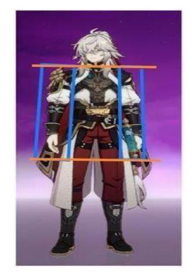
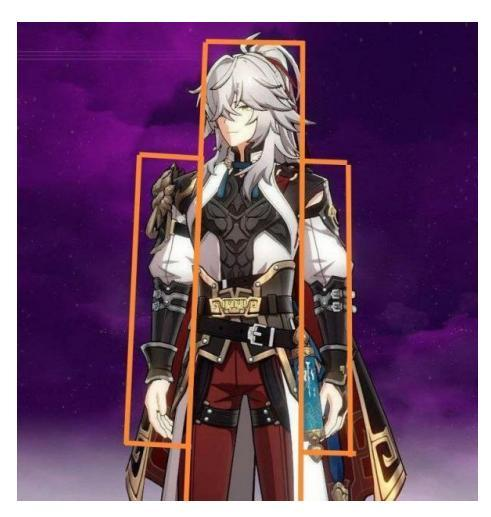
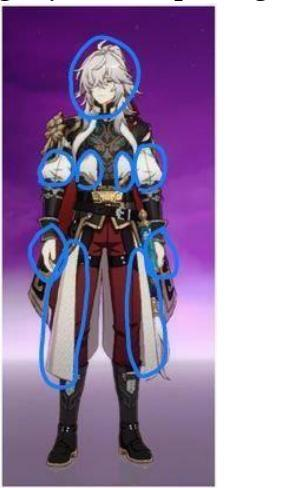
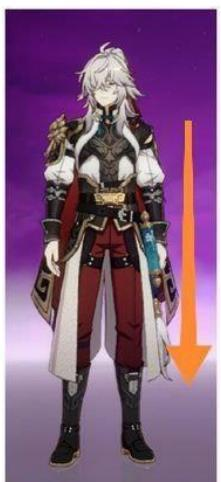

Jurnal Bisnis dan Komunikasi Digital: Volume 1, Nomor 2, 2024, *Hal*: 1-13

# **Analisis Desain Komunikasi Visual Karakter Jing Yuan dalam Game Honkai Star Rail**

**Maurinsa Maharani1\*, Suryati2 , Manalullaili3**

1,2,3 Universitas Islam Negeri Raden Fatah[; maurinsa91@gmail.com,](mailto:maurinsa91@gmail.com) [suryati\\_uin@radenfatah.ac.id,](mailto:suryati_uin@radenfatah.ac.id) [manalullaili\\_uin@radenfatah.ac.id](mailto:manalullaili_uin@radenfatah.ac.id)

**Abstrak:** Pokok permasalahan penelitian ini adalah untuk mencari tahu bagaimana hasil analisis desain karakter Jing Yuan dari game Honkai Star Rail. Tujuan dari penelitian ini adalah untuk mendalami aspek desain komunikasi visual karakter yang memiliki popularitas tinggi dalam suatu video game yang juga diminati secara luas. Sehubung Honkai Star Rail merupakan game rilisan terbaru dari game developer MiHoYo pada tahun 2023 dan menjadi populer di kalangan penggemar video game RPG (roleplaying game), serta karakter rilisannya yaitu Jing Yuan yang sampai sempat merusak platform top up Honkai Star Rail China karena kepopulerannya di kalangan penggemar, maka dipilihlah karakter game ini menjadi objek dari penelitian ini. Dalam penelitian ini, digunakan pendekatan kualitatif di mana desain karakter dianalisis secara mendalam melalui penerapan metode Manga Matrix. Selain itu, desain karakter juga ditelaah dengan menggunakan Teori Gestalt (Prinsip Visual) dan Model Komunikasi Harold D. Laswell guna untuk mengetahui keefektifan penyampaian pesan dari desain karakter tersebut. Hasil utama dari penelitian ini menyoroti bahwasanya desain yang dapat dengan mudah dipahami oleh pemain, tidak hanya memperoleh tanggapan positif dari para audiensnya, tetapi juga mampu menyampaikan pesan komunikasi secara efektif. Melalui penelitian ini, didapati pemahaman akan bagaimana perancangan karakter video game RPG yang diminati oleh para pemain game khususnya video game RPG dan menelaah bentuk penyampaian pesan komunikasi yang efisien melalui desain komunikasi visual. Kesimpulan akhir dari penelitian ini, pentingnya menerapkan desain komunikasi visual yang baik menjadi kritis untuk kelancaran penyampaian informasi, dalam konteks desain komunikasi visual.

**Katakunci:** Desain Karakter, Komunikasi Visual, Game

#### DOI:

<https://doi.org/10.47134/jbkd.v1i2.2281> \*Correspondensi: Maurinsa Maharani Email[: maurinsa91@gmail.com](mailto:maurinsa91@gmail.com)

Received: 06-12-2023 Accepted: 15-01-2024 Published: 28-02-2024

**Copyright:** © 2024 by the authors. Submitted for open access publication under the terms and conditions of the Creative Commons Attribution (CC BY) license

(http://creativecommons.org/licenses/by/ 4.0/).

**Abstract:** *The main issue of this research is to find out how the analysis results of Jing Yuan's character design from the Honkai Star Rail game. The purpose of this research is to delve into the aspects of visual communication design of characters that have high popularity in a video game that is also widely favored. Given that Honkai Star Rail is the latest release from game developer MiHoYo in 2023 and has become popular among RPG (roleplaying game) video game fans, and its released character Jing Yuan has even disrupted the Honkai Star Rail China top-up platform due to its popularity among fans, this game character was chosen as the subject of this research. In this study, a qualitative approach is used, where character design is analyzed in depth through the application of the Manga Matrix method. Additionally, character design is also examined using Gestalt Theory (Visual Principles) and Harold D. Laswell's Communication Model to determine the effectiveness of conveying messages from the character design. The main findings of this research highlight that designs that are easily understood by players not only receive positive feedback from their audiences but also effectively convey communication messages. Through this research, an understanding is gained of how the character design of RPG video games is favored by players, especially RPG video game players, and an examination of the form of efficient communication message delivery through visual* 

*communication design. The final conclusion of this research emphasizes the critical importance of applying good visual communication design for the smooth delivery of information, in the context of visual communication design.*

**Keywords:** *Character Design, Visual Communication, Games*

## **Pendahuluan**

Komunikasi merupakan hal yang sangat dekat dengan manusia. Sejak terlahir ke dunia, bayi dengan alamiah melakukan komunikasi dengan sekitarnya dalam bentuk menangis. Bayi akan merespon dengan menangis jika ia mengalami rasa sakit, kelaparan, kelelahan, kebosanan, atau ketidaknyamanan akibat basahnya popok. Menangis menjadi metode komunikasi yang digunakan oleh bayi untuk menyampaikan berbagai perasaan dan kebutuhannya. Oleh karenanya, komunikasi menjadi sesuatu yang erat dalam kehidupan manusia karena dilakukan untuk menyampaikan sesuatu yang dirasakan oleh setiap individu. Seringkali komunikasi menjembatani diskusi, edukasi, dan proses-proses lainnya yang kerap dilakukan dalam keseharian.

Komunikasi merupakan hal yang sangat penting dalam kehidupan manusia. Komunikasi yang baik dan efektif dapat sangat membantu untuk mengantarkan pesan secara tepat pada penerima pesan. Berkomunikasi secara efektif sendiri berarti bahwa komunikator dan komunikan sama-sama memiliki pengertian yang sama tentang suatu pesan (Nurul Fatmawati). Namun, tak jarang pesan yang tersampaikan tidaklah efektif karena komunikasi tidak mengandung kesepahaman, akibat komunikan tidak mengerti isi pesan dan tidak melaukannya sebagaimana yang dikehendaki komunikator, sehingga membuat kesalahpahaman. Oleh karenanya dibutuhkanlah desain komunikasi visual sebagai sebuah visualisasi pesan yang disampaikan dari suatu komunikasi.

Diberlakukannya desain komunikasi visual, untuk menerangkan pesan yang ingin disampaikan melalui komunikasi. Manusia adalah makhluk visual. Manusia akan belajar dan memahami dengan lebih cepat dengan adanya suatu contoh penggambaran atau visualisasi. Desain sendiri adalah suatu rencana atau gambaran yang dibuat untuk memperlihatkan tampilan dan fungsi dari suatu objek yang belum benar-benar dibuat.

Kekuatan huruf memberikan banyak kontribusi terhadap kekayaan ilmu desain grafis mulai dari ornamen huruf, titik, dan estetikanya. Kekayaan arsitektur Al-Quran melahirkan ilmu tipografi setiap huruf dengan model dan bentuk lekuk sesuai daya tampung kesan, arti, makna, simbol, dan keindahan sebuah huruf memengaruhi psikologi manusia. Oleh karena itu, sesuai ayat yang telah tertulis, menekuni ilmu desain sangat diperlukan sebagai suatu perencanaan yang matang. Terutama ilmu desain untuk merancang visual dari suatu komunikasi.

Desain komunikasi visual diberlakukan di seluruh aspek kehidupan manusia, mulai dari yang paling sederhana, hingga yang paling rumit. Contohnya seperti lampu lalu lintas berwarna merah yang menandakan 'berhenti', kuning yang menandakan 'siaga', dan hijau yang menandakan untuk 'boleh melaju'. Selain itu, desain komunikasi visual juga terdapat pada prosedur penggunaan yang biasa terdapat pada bagian belakang suatu kemasan produk. Hingga yang cukup rumit, desain komunikasi visual pun juga terdapat pada desain website seperti contohnya simbol 'x' menandakan cancel. Karenanya, desain komunikasi visual terdapat di seluruh aspek kehidupan kita untuk mempermudah proses berkomunikasi untuk menyampaikan pesan dalam sehari-hari. Salah satunya pula aspek desain dalam industri game, yaitu aspek desain karakter.

Di era kini, industri game merupakan salah satu industri yang sedang mengalami pertumbuhan dan tampaknya akan mengalami prospek yang cerah di masa depan. Berdasarkan penelitian Ellavie Ichlasa Amalia, di tahun 2023, pemasukan dari industri mobile game diperkirakan mencapai USD 92,6 miliar atau setara dengan 1 triliun rupiah dengan total pemasukan untuk industri game global diperkirakan akan mencapai USD 187,7 miliar Ellavie Ichlasa Amalia). Industri game adalah sektor besar yang tidak hanya mencakup pengembangan, pemasaran, dan monetisasi video game, tetapi juga produksi, distribusi, dan konsumsi konten yang dihasilkan oleh video game. Keuntungan dalam industri game didapat dengan cara membuat game berbayar ataupun pembelian di dalam game. Dan dalam mendapatkan keuntungan, sebuah game haruslah dibuat dengan aspekaspek yang menjual bagi para pemain game. Dalam berbagai aspek dalam game, aspek desain menjadi satu aspek yang paling utama dalam pembuatan video game.

Para penanggung jawab dalam desain harus dapat membentuk desain visual game yang menjual, karena seperti yang sudah dijelaskan sebelumnya, aspek visual game menjadi salah satu aspek utama yang menarik minat pemain video game. Desain visual dalam sebuah game meliputi desain dunia game, cara bermain, kota, karakter, dan sebagainya. Dalam desain visual sebuah video game, karakter menjadi aspek paling kuat yang menarik minat para pemain. Berbeda dengan film dan animasi, desain karakter game lebih kompleks karena harus sesuai dengan play di dalamnya. Li, Rao, dan Wu (2008) mengatakan bahwa menurut hipotesa yang telah diuji menggunakan kuisioner terhadap 253 pemain game online, mengindikasikan bahwa latar cerita, grafik visual, dan proses pengontrolan karakter berpengaruh besar pada kesenangan serta kepuasan pemain dan juga mempengaruhi intensi pembelian virtual item dalam game online oleh pemain (Li P Rao S, 2008). Desain karakter menjadi sangat penting dalam game karena karakter tersebut menggambarkan seperti apa dunia game di dalamnya, bagaimana alur cerita suatu game, serta penggambaran interaksi antara game dengan pemain. Seperti contoh, karakter dengan latar belakang viking tentu memiliki desain yang berbeda dengan karakter science fiction. Selain itu ada beberapa skill khusus yang harus disesuaikan dengan karakter yang akan dibuat. Tidak hanya itu, artsyle dalam visualisasi game pun juga harus dipertimbangkan dengan baik sesuai genre dan apa yang diminati kebanyakan pemain game di genre tersebut. Oleh sebab itu, para designer harus melakukan riset terhadap pasar sebelum melakukan tahapan perancangan.

Sebagai mahasiswa dalam proses pembelajaran ataupun sebagai pengembang game, mengamati desain komunikasi visual dari game yang tenar menjadi salah satu hal yang perlu dicoba untuk dilakukan. Kita dapat membedah sebuah desain dari cara mengamatinya sebagai pembelajaran, dan pada akhirnya nanti dipraktikkan sendiri dengan melewati banyak modifikasi yang telah disesuaikan pada game yang kita buat. Dalam ranah kreatif, hal tersebut sangat efektif pula untuk mempelajari riset tentang apa yang para pemain sukai dalam sebuah game.

Salah satu game yang sedang tenar di tahun 2023 lalu adalah 'Honkai: Star Rail'. Dirilis pada 26 April 2023, Honkai Star Rail adalah game action role-playing gacha, berbasis turn-based yang dikembangkan oleh MiHoYo, pengembang game yang sama dengan game Genshin Impact yang populer sejak perilisannya di 2021 hingga kini. Dengan lebih dari 30 juta unduhan saat perilisan dan jauh melebihi 11 juta pra-registrasi, game ini hampir sepopuler Genshin Impact hanya seminggu setelah diluncurkan (Playerauctions Honkai STr Rail) Bertemakan tentang luar angkasa dengam bumbu fantasi, Honkai Star Rail sangat disukai oleh para penggemar game, khususnya game RPG. Menyajikan cerita yang menyegarkan dan terasa keorisinilannya, menjadi daya tarik yang tinggi dari Honkai Star Rail. Selain itu, daya tarik utama dari Honkai Star Rail adalah banyaknya karakter-karakter yang didesain dengan apik dari segi visual hingga latar belakangnya. Membuat para pemain gemar untuk memainkannya hingga berjam-jam lamanya. Salah satu karakter paling populer selama perilisan versi Honkai Star Rail hingga sejauh ini adalah Jing Yuan. Jing Yuan adalah karakter bintang 5 di Honkai Star Rail yang dinantikan oleh banyak penggemar. Peluncuran banner Jing Yuan terbukti sukses karena banyaknya pemain yang melakukan top up untuk melakukan warp saat banner ini dirilis, hingga merusak platform pembayaran game Honkai Star Rail China. Hal ini menjadi bukti keberhasilan desain karakter Honkai Star Rail karena sangat digandrungi oleh banyak penggemar dan dinantikan bahkan sebelum banner gacha karakter tersebut dirilis.

## **Metode Penelitian**

Penelitian ini mengadopsi pendekatan penelitian kualitatif deskriptif. Alasan pemilihan metode penelitian ini adalah karena metode kualitatif deskriptif menekankan pengumpulan data berupa kata-kata, gambar, dan bukan angka-angka. Dengan demikian, hasil penelitian dapat diuraikan melalui deskripsi yang jelas dan sesuai. Menurut Bogdan dan Taylor, sebagaimana dikutip oleh Lexy J. Moleong, penelitian kualitatif adalah suatu prosedur penelitian yang menghasilkan data deskriptif dalam bentuk kata-kata tertulis atau lisan dari orang-orang dan perilaku yang diamati. Di sisi lain, penelitian deskriptif merujuk pada suatu bentuk penelitian yang bertujuan mendeskripsikan atau menggambarkan fenomena-fenomena yang ada, baik itu fenomena alamiah maupun rekayasa manusia. Ada pun tujuan dari penelitian kualitatif deskriptif dalam konteks ini adalah untuk mengeksplorasi hasil analisis desain karakter Jing Yuan dalam Honkai Star Rail dengan menggunakan metode Manga Matrix.

Penelitian ini mengadopsi metode penelitian kualitatif. Menurut Sugiyono, penelitian kualitatif merupakan suatu ilmu sosial yang berfokus pada pengamatan dalam materi pelajaran dan terminologi. Metode penelitian kualitatif, sebagaimana dijelaskan oleh Sugiyono, didasarkan pada filsafat dan digunakan untuk menyelidiki kondisi ilmiah, termasuk eksperimen, di mana peneliti berperan sebagai instrumen utama. Teknik pengumpulan dan analisis data dalam penelitian kualitatif lebih mengutamakan aspek kualitatif yang lebih menekankan pada makna.

### Data dan Jenis Penelitian

Berdasarkan metode penelitian yang digunakan yaitu penelitian kualitatif, data primer, data sekunder, dan objek dalam penelitian ini adalah sebagai berikut:

a. Data Primer

Pada penelitian ini, data primer merupakan karakter Jing Yuan dari Honkai Star Rail. Sebagai objek penelitian untuk dianalisis desain karakterisasinya, karakter Jing Yuan menjadi data primer dalam penelitian ini.

b. Data Sekunder

Data sekunder adalah data yang pendukung yang digunakan untuk melengkapi data primer. Pada penelitian ini, data sekunder didapat dari buku Manga Matrix: Create Unique Characters Using the Japanese Matrix System karya Hiroyoshi Tsukamoto sebagai landasan teori, serta analisis isi dari laman Wikia Fandom Jing Yuan juga autobase fandom Twitter Honkai Star Rail yaitu pompomfess. Lalu, dokumentasi dilakukan dengan pengambilan screenshot ingame karakter.

## Teknik Pengumpulan Data

Berdasarkan objek, tujuan, dan masalah yang akan diteliti, peneliti akan menggunakan teknik pengumpulan data sebagai berikut:

a. Analisis Dokumen

Analisis dokumen, yang disebut content analysis (Robert K. Yin, 2000: 106), merupakan metode penelitian ilmiah yang bertujuan untuk mengidentifikasi karakteristik isi dan menyimpulkan inferensi dari kontennya. Proses analisis dokumen melibatkan eksplorasi mendalam terhadap informasi tertulis atau tercetak dalam media massa. Harold D. Lasswell dianggap sebagai pelopor analisis isi dengan pendekatannya yang melibatkan pencatatan simbol atau pesan secara terstruktur, kemudian dilakukan interpretasi. Dalam konteks ini, peneliti tidak hanya mencatat isi yang tersurat dalam dokumen, melainkan juga menggali makna yang tersirat secara kritis. Dokumen dapat digunakan bersamaan dengan sumber informasi lain, seperti wawancara dan pengamatan, untuk memastikan konsistensi gambaran yang dihasilkan oleh bukti yang dikumpulkan.

Semua dokumen yang berkaitan dengan topik penelitian dapat dimanfaatkan untuk menguji, menafsirkan, dan bahkan untuk meramalkan data dalam penelitian (Lexy J. Moleong, 1990: 161). Dengan adanya analisis dokumen diharapkan dapat ditangkap informasi tentang subjek yang diteliti mengenai pembentukan dan pengalihan perilaku serta polanya yang berlangsung melalui komunikasi verbal (Noeng Muhadjir, 1990: 49).

b. Dokumentasi

Teknik dokumentasi adalah cara pengumpulan data yang melibatkan penelitian terhadap informasi yang telah dicatat. Secara etimologis, dokumentasi berasal dari kata 'dokumen' yang merujuk pada barang-barang tertulis. Dalam menerapkan metode dokumentasi, peneliti memeriksa benda-benda tertulis seperti buku, majalah, peraturan, dokumen, notulensi rapat, dan catatan harian, antara lain. Dalam konteks penelitian ini, metode dokumentasi digunakan untuk melengkapi data yang telah diperoleh dari hasil pengamatan.

## **Hasil dan Pembahasan**

Selayaknya dalam komunikasi, desain komunikasi visual yang baik harus mampu menyampaikan pesan dengan tepat kepada para pengamatnya tanpa adanya gangguan atau *'noise'. Noise* dalam desain dapat berupa beban kognitif, yakni usaha mental yang harus dilakukan untuk dapat memproses dan mempelajari informasi. Dalam memproses data, otak memerlukan usaha untuk memahami sebuah data tersebut. Semakin mudah sebuah data diproses oleh otak dan mengurangi beban kognitif, pesan akan semakin tersampaikan dengan tepat. Termasuk pada desain, semakin mudah sebuah desain dimengerti oleh otak, semakin pesan dibalik desain tersebut mudah sampai kepada yang melihatnya. Dalam perdesainan visual karakter game RPG, proses desain karakter umumnya lebih kompleks dibandingkan dengan desain grafis. Sebab suatu karakter bukan bidang datar dan memiliki desain di seluruh bagian tubuhnya, mulai dari ujung kepala hingga ujung kaki dan tubuh bagian depan dan belakang. Sehingga menjadikan desain suatu karakter sebagai proses perdesainan yang lebih rumit supaya hasil desain dapat menyampaikan pesannya secara mudah kepada para pemain, tanpa adanya gangguan (*noise*).

Dengan menganalisis desain karakter Jing Yuan menggunakan teori Manga Matriks sebelumnya, didapat hasil pembedahan desain sang karakter. Hasil tersebut kali ini akan dianalisis dengan prinsip Gestalt untuk menemukan bagaimana desain sang karakter dapat dengan mudah diterima oleh para pemain dan menjadikan karakter ini sangat digemari.

1. *Enclosure*

Setelah menganalisis desain Jing Yuan menggunakan Manga Matrix, dapat disimpulkan bahwa desainnya, sebagai manusia, menjadi lebih mudah dipahami karena tubuh manusia memiliki kaki dan tangan yang terletak simetris di kiri dan kanan, serta kepala dan torso yang terpusat, menciptakan visualisasi Jing Yuan yang mudah dicerna berkat adanya pembatas yang jelas.

Penting untuk dicatat bahwa penggunaan warna juga turut mendukung dalam membentuk 'batas' antara lengan, bahu, kaki, dan betis. Warna yang berbeda membantu memudahkan pemahaman dan memisahkan bagian-bagian tubuh Jing Yuan, sebagaimana dijelaskan pada gambar 4.1 di bawah ini:

**Gambar 1.** Kesimetrisan yang Menjadikannya Pembeda

## 2. *Proximity*

Bentuk tubuh Jing Yuan yang merupakan bentuk tubuh manusia pun memberi kemudahan dalam memahami desain karakternya. Bentuk tubuh manusia yang terdiri dari kepala, kaki, tangan, dan badan, sudah sangat terinternalisasi dalam benak tiap orang yang membuat orang-orang dengan mudah mengelompokkan setiap desain yang berada di bagian-bagian tertentu sebagai sebuah kesatuan.

Sebagai contoh, tameng, jubah, ikat pinggang, serta baju panjang sang

karakter dapat dengan mudah diterima sebagai bagian dari 'pakaian' karena semua terletak pada bagian 'badan'. Meskipun desain pakaian nampak rumit dengan relief dan aksesori yang banyak, namun informasi bahwa semua merupakan 'pakaian' dapat dengan mudah dimengerti karena semua terletak pada bagian badan, sebagaimana dijelaskan pada gambar 4.1 di bawah ini:

**Gambar 2.** Pengotakkan pada Tubuh Jing Yuan yang Menampakkan Batas-Batas Tubuh Karakter Sehingga Memudahkan Pemahaman

Contoh lainnya pula terdapat pada bagian celana dan baju bagian belakangnya yang panjang. Para pemain *game* atau orang-orang yang melihat desain visual dari karakter Jing Yuan ini dapat dengan mudah membedakan bahwa baju panjang merupakan bagian dari 'badan' sementara celana merupakan bagian dari 'kaki' meskipun berada pada letak yang beriringan. Semua dikarenakan desain kostum sang karakter dikelompokkan berdasar bagian-bagian dekat tertentu yang umum ditemukan dalam keseharian orangorang, seperti halnya tubuh, kaki, lengan, dan kepala.

3. *Similarity*

Visualisasi desain pada Jing Yuan pun dipermudah melalui penggunaan warna. Selain untuk mempermudah karena unsur kesamaan, warna-warna juga melambangkan banyak arti. Warna hitam, yang memberikan kesan kokoh, ditempatkan pada bagian-bagian penopang seperti kaki, lengan bawah, dan bahu, mencerminkan profesi Jing Yuan sebagai jenderal. Warna merah yang diselipkan pada bagian celana dan beberapa aksesoris, memberikan kesan 'berani'. Baju panjang bagian belakang yang memberikan kesan berwibawa seperti kaisar zaman dulu dapat diakui melalui pemilihan warna putih yang dominan pada bagian tersebut. Secara simetris, warna putih juga ditempatkan pada rambut dan lengan, menciptakan kesan seragam. Contoh lainnya ada pada pemilihan warna hitam yang dikelompokkan pada bahu, lengan, dan kaki yang simetris, dengan mudah mengkomunikasikan kesan kokoh secara langsung kepada penonton, karena elemen-elemen tersebut ditempatkan secara berdekatan.
Kesan keseragaman yang diciptakan dari warna-warna yang diberikan untuk detil yang sama, memudahkan pesan-pesan tiap warna sampai kepada pemain game. Pemain game dapat dengan mudah menangkap setiap warna putih pada desain kostum Jing Yuan sebagai fitur lembut, begitu pula menangkap setiap warna hitam merupakan tameng karena kesan kokoh dari warna yang diberikan, sebagaimana yang dijelaskan pada gambar 4.2 di bawah ini:

- **Gambar 3.** Warna-Warna yang Dipadukan dalam Desain Jing Yuan Memudahkan Cara Pandang MataMemahaminya Seperti yang Ditunjukkan Lingkaran Biru (melingkari warna) dan Garis Oranye (menunjukkan kemudahan mata memandangnya)
  - *4. Connection*

Koneksi dalam desain kostum Jing Yuan terdapat pada arah jatuhnya baju sesuai arah atas-bawah. Yang mana pakaian Jing Yuan seluruhnya serempak mengarah dari atas ke bawah, tidak ada arah jatuhnya pakaian yang dari kiri-kanan ataupun depan-belakang. Hal ini membuatnya lebih mudah dipahami karena merupakan fenomena yang lumrah terjadi, sebagaimana halnya gravitasi bumi yang membuat barang terjatuh ke bawah. Sebagaimana yang dijelaskan pada gambar 4.3 di bawah ini:

**Gambar 4.** Arah Jatuhnya Pakaian Yaitu ke Bawah

Melalui analisis desain menggunakan prinsip Gestalt, didapatlah desain simetris dan penggunaan warna yang terintegrasi dengan baik dan rapi memberikan kemudahan dalam memahami sebuah karakter. Visualisasi yang mudah dicerna tidak hanya memudahkan pembaca atau pemain *game* untuk mengidentifikasi setiap detil karakter, tetapi juga mendukung pemahaman lebih mendalam terhadap karakter dan pesan yang ingin disampaikan. Dalam hal ini, karakter Jing Yuan yang memenuhi prinsip desain karakter yaitu 'berlebihan' dengan kostumnya yang begitu rumit, tetap ditempatkan dengan integrasi yang baik dan rapi sesuai prinsip Gestalt sehingga desain rumit itu dapat dengan mudah dipahami dan menyampaikan pesan yang ingin disampaikan dengan baik.

## **Hubungan Analisis Karakter Jing Yuan dengan Teori Model Komunikasi Dasar Harold D. Laswell**

Definisi komunikasi menurut Lasswell memiliki 5 elemen yaitu who, says what, in which channel, to whom, dan with what effect. Berdasarkan elemen komunikasi dari Lasswell, komunikasi harus memiliki efek, seperti perubahan perilaku audiens seperti halnya perubahan pada tingkat pengetahuan atau kemampuan kognitif, perubahan emosi, perasaan atau afektif, perubahan dalam hal tingkah laku atau psikomotorik.

Desain karakter dibuat dengan mempertimbangkan latar kisah dari sang karakter tersebut. Dalam hal ini pun sama, karakter Jing Yuan didesain dengan memenuhi latar kisah (pesan) yang ingin disampaikan oleh developer game Honkai Star Rail. Dalam game Honkai Star Rail yang bertemakan ruang angkasa, Jing Yuan adalah seorang manusia yang berasal dari planet Xianzhou, planet yang kental dengan kebudayaan Cina-nya. Jing Yuan tergabung dalam aliansi Ksatria Awan Xianzhou (Cloud-Knight Xianzhou) yang berisikan tujuh jenderal, dengan posisinya sebagai jenderal terkuat. Di usia muda, Jing Yuan dilatih menjadi seorang Ksatria Awan oleh Jingliu, seorang ahli pedang terkenal, membuat Jingliu menjadi sosok guru yang sangat dihormati oleh Jing Yuan. Namun, Jingliu terkena kutukan yang membahayakan planet Xianzhou dan Jing Yuan sebagai jenderal terkuat mesti mengalahkannya dalam pertempuran sengit. Membuat Jing Yuan memiliki masa lalu yang kelam karena membunuh gurunya sendiri.

Dari latar kisah Jing Yuan, dapat dipahami mengapa karakter mengenakan tameng dan pedang, serta didesain dengan sentuhan 'wibawa' karena ia adalah seorang jenderal. Desain Jing Yuan yang pula menitikberatkan pada estetika Cina dan fitur-fitur etnis Cina, mewakilkan pengenalan kultur Cina yang ingin disampaikan oleh developer game itu sendiri.

Dengan diuraikan menggunakan model komunikasi Laswell, penyampaian pesan melalui sebuah desain karakter adalah valid. Sebab dalam analisis karakter Jing Yuan ini, ditemukan bahwasanya proses desain hingga kepada pemain adalah sebuah komunikasi linear yang baik. Penguraiannya adalah sebagai berikut:

*1. Who*

Dalam teori ini, "who" merujuk kepada sumber atau pihak yang perlu

berkomunikasi dan memulai proses komunikasi terlebih dahulu. Dalam analisis ini, "who" adalah pengembang game yang membuat dan mendesain game Honkai Star Rail beserta karakter-karakternya sesuai dengan latar belakang masing-masing karakter yang menyisipkan pesan yang ingin disampaikan. Pada karakter Jing Yuan, desainer karakter menyisipkan unsur kebudayaan Cina yang kental terutama pada seni pedangnya, yang ditunjukkan melalui desain karakter Jing Yuan dan latar belakang kisahnya yang terikat pada sifat-sifat desain karakter tersebut. Dengan tampilan yang menarik, para pemain game secara tidak sadar menerima informasi yang disampaikan oleh visualisasi desain karakter yang menarik.

*2. Says what*

*"Says what"* dalam teori ini mengacu pada penjelasan pesan yang akan disampaikan kepada komunikan atau penerima. Sumber pesan tersebut bisa berasal dari komunikator atau dari suatu informasi. Komunikasi dapat bersifat verbal atau nonverbal, dan dalamnya terdiri dari tiga komponen pesan, yaitu makna, simbol, dan bentuk pesan. Dalam analisis karakter ini, desain karakter Jing Yuan secara keseluruhan, mulai dari bentuk, kostum, dan kepribadian karakternya, menjadi penyampaian pesan dalam bentuk nonverbal. Pesan yang disampaikan melalui desain karakter Jing Yuan juga berupa pesan kultural yang bermaksud mengenalkan sedikit tentang seni pedang Cina.

*3. In which channel*

Di teori ini, "in which channel" merupakan media atau alat untuk menyampaikan pesan dari komunikator ke komunikan secara langsung atau melalui media digital. Dalam analisis karakter ini, media penyampaian pesan adalah dalam bentuk media digital berupa game Honkai Star Rail.

*4. To whom*

*To whom* di teori ini berarti siapa atau penerima pesan dalam komunikasi, baik itu individu, kelompok, organisasi, bahkan negara. To whom juga bisa disebut dengan kata lain, yaitu tujuan (*destination*), pendengar (*listener*), audiens, komunikan, penafsir, hingga decoder. Dalam analisis karakter ini, to whom merupakan para pemain yang memainkan game Honkai Star Rail.

*5. With what effect*

*With what effect* adalah dampak atau efek yang terjadi pada penerima (komunikan) setelah menerima pesan dari komunikator. Dari analisis desain karakter Jing Yuan ini, para pemain game Honkai Star Rail mendapatkan pengetahuan terkait kultur Cina melalui desain Jing Yuan yang sangat kental akan ciri-ciri khas yang berasal dari Cina, juga mengenai seni pedang Cina melalui latar belakang kisah karakter yang terikat pada sifat sang karakter. Atau secara ringkas dapat disimpulkan sebagai berikut:

Melalui desain karakter Jing Yuan, developer game (*who*) yang membuat dan mendesain game Honkai Star Rail ini menceritakan kultur Cina terutama tentang seni pedang (*says what*) melalui gameplay dan latar belakang kisah karakter Jing Yuan (*in which channel*) kepada para pemain game Honkai Star Rail (*to whom*) yang menjadikan para pemain game mengenal budaya dan kultur Cina tentang seni pedang karenanya (*with what effect*).

Melalui penjabaran ini, dapat dilihat bahwa komunikasi linear yang dilakukan oleh game Honkai Star Rail kepada para pemainnya melalui desain karakter untuk mengenalkan tentang kultur Cina memenuhi model komunikasi Laswell.

## **Kesimpulan**

Berdasarkan dari hasil penelitian yang telah diuraikan menyatakan bahwa, analisis karakter Jing Yuan dalam game Honkai Star Rail, mengungkap pentingnya peran desain visual sebuah karakter dalam menarik minat para pemain untuk memainkan video game RPG yang diciptakan. Tampilan visual lah yang pertama kali ditangkap oleh mata dan menciptakan persepsi suatu game dalam benak para pemain, sehingga mendesain visual sebuah karakter perlu dipertimbangkan dengan baik agar dapat membuat pemain game tertarik dan loyal pada game. Lalu, desain visual sebuah karakter yang mencakup rancangan fisik, kostum, dan sifat. Komunikasi yang baik di dalam sebuah desain visual dapat menyampaikan informasi dengan tepat kepada semua yang melihatnya. Sama halnya seperti pada desain visual sebuah karakter game, desain visual yang baik dapat menyampaikan pesan kepada para pemain secara tepat.

Dianalisis menggunakan metode Manga Matrix, diurailah detil elemen-elemen visual yang menjadi struktur dasar perancangan karakter Jing Yuan. Melalui analisis menggunakan metode Manga Matrix, didapati dasar perancangan bentuk fisik, rancangan kostum, dan rancangan sifat dari karakter ini. Bentuk fisik Jing Yuan memiliki kulit, telinga, kaki, tangan, dan mulut yang mirip dengan manusia. Menjadikannya masuk dalam kategori fisik humanoid atau manusia. Ciri-ciri fisiknya meliputi kulit cerah, wajah yang ramping, mata yang sempit, dan mulut mirip kucing, dengan rambut putih yang panjang. Dan berdasar Manga Matrix juga, kostum Jing Yuan terdiri dari pakaian hitam berlengan panjang dengan celana merah, baju besi, dan hiasan berbentuk singa. Dia membawa pedang besar yang dapat memanggil arwah singa kesayangannya. Kostumnya mencerminkan desain tradisional Cina. Rancangan sifat sang karakter dalam Manga Matrix pula mencakup sifat tenang, bijaksana, dan dapat diandalkan, dengan kecenderungan bermalas-malasan.

Ditelaah menggunakan Teori Persepsi Visual, desain Jing Yuan menerapkan penggunaan prinsip penutupan, kedekatan, kesamaan, dan keterhubungan. Prinsip-prinsip tersebut diterapkan dalam kesimetrisan, penggunaan warna, dan batas yang jelas, membuat desain karakter ini mudah dipahami oleh benak para pemain dan tidak menghasilkan noise dalam penyampaian pesannya. Keefektifan penyampaian pesan melalui desain karakter game ini ditelaah pula melalui Model Komunikasi Dasar Harold D. Laswell. Desain Jing Yuan mengkomunikasikan budaya Tiongkok dan seni pedang kepada pemain, sejalan dengan kerangka Laswell: pengembang sebagai komunikator, game sebagai saluran, dan pemain sebagai audiens. Pemain, sebagai respons, memperoleh pengetahuan tentang budaya Cina, menunjukkan efektivitas komunikasi karakter. Ini menghasilkan komunikasi efektif elemen budaya dari pengembang ke pemain.

Game merupakan media yang menyenangkan terutama bagi para remaja. Mengenalkan kultur budaya dan pesan-pesan lainnya melalui desain visual karakter yang baik dan mudah dicerna dapat mengantarkan pesan dengan tepat pada benak para pemain game. Oleh karena itu, menerapkan desain komunikasi visual yang baik dalam perancangan desain karakter game penting untuk diperhitungkan.

## **Daftar Pustaka**

- Agung, L. dan Wiwaha, L. 2022. "Preliminary Study into Genshin's Impact's Aesthetics: The Sustainability of Visual Culture Through The Design Character. Sustainable Development in Creative Industries: Embracing Digital Culture for Humanities." 2022.
- Alvini, T. dan Guntur, T. "Perancangan Karakter Antropomorfik Eka Dasa Rudra sebagai Media Pengenalan Folklor Bali." Visual Communication Design, vol. 3, no. 1, 2014.
- Amalia, E. 2023. Newzoo: Industri Game Global Masih Tumbuh di 2023, Segmen Konsol Jadi Kunci, diakses pada tanggal 8 September 2023 dari https://hybrid.co.id/post/newzoo-industri-game-global-masih-tumbuh-di-2023 segmen-konsol-jadi-kunci/
- Dahman, D. 2021. Persepsi Visual (Prinsip Gestalt), diakses pada tanggal 24 November 2023 dari https://medium.com/sysinfo/persepsi-visual-prinsip-gestalt-ceaa75b7d934
- Fatmawati, N. 2021. Berkomunikasi Secara Efektif, Ciri Pribadi yang Berintegritas Dan Penuh Semangat, diakses pada tanggal 9 Oktober 2023 dari https://www.djkn.kemenkeu.go.id/kpknl-semarang/bacaartikel/13988/Berkomunikasi-Secara-Efektif-Ciri-Pribadi-yang-Berintegritas-Dan-Penuh-Semangat.html
- Hafiz Alfajri. Analisis Harimau Gemuk Dalam Karya Graffiti Indombrain Sebagai Media Komunikasi Visual. Skripsi S1 UIN Raden Fatah Palembang.
- Honkai Star Rail Team. 2023. 崩坏星穹铁道, diakses pada tanggal 29 Juni 2023 dari https://weibo.com/u/7643376782/
- Imam Akbar. Analisis Desain Visual Mobile Legends Bang Bang Terhadap Gamer. Skripsi S1 UIN Raden Fatah Palembang.
- Kemenparekraf. 2020. Potensi Desain Komunikasi Visual Bagi Peningkatan Pertumbuhan Ekonomi di Era Digital, diakses pada tanggal 8 September 2023 dari https://www.kemenparekraf.go.id/ragam-ekonomi-kreatif/Potensi-Desain-Komunikasi-Visual-Bagi-Peningkatan-Pertumbuhan-Ekonomi-di-Era-Digital/
- Li, P., Rao, S. dan Wu, J. "Why They Enjoy Virtual Game Worlds? An Empirical Investigation." Journal of Electronic Commerce Research, vol. 9, no. 3, 2008.
- Maimunah, M. Sunarya, L. dan Larasati, N. "Media Company Profile Sebagai Sarana Penunjang Informasi dan Promosi" CCIT (Creative Communication and Innovative Technology) Journal. Vol. 5, No. 3, 2012.
- Moleong, L. (1990). Metodologi Penelitian Kualitatif. Bandung: PT. Rosdakarya.
- Muhadjir, N. (1990). Metode Penelitian Kualitatif. Yogyakarta: Rake Sarasin.
- Niket, M. Suparna, D. dan Asit, B. "Video Games to Convey Serious Messages A Study Using Food Force 2 Game." KIET International Journal of Communications & Electronics, vol. 3, no. 2, 2013.

- Novica, D. dan Hidayat, I. "Kajian Visual Desain Karakter Pada Maskot Kota Malang." Journal of Art, Design, Art Education and Culture Studies (JADECS). Vol. 3, No. 2, 2018.
- Nugrahani, F. dan Hum, M. (2014). Metode Penelitian Kualitatif dalam Penelitian Pendidikan Bahasa. Solo: Cakra Books.
- Playerauctions. 2023. Honkai Star Rail Player Count (Estimated) Game Popularity Based on Google Trends, diakses pada tanggal 29 Juni 2023 dari https://www.playerauctions.com/player-count/honkai-star-rail/
- Prasetya, X. dan Anggapuspa, M. 2022. "Analisis Visual Desain Karakter Xiao dalam Game Genshin Impact." BARIK. Vol. 4, No. 2. 2022.
- Putra, R. (2021) Penghantar Desain Komunikasi Visual. Yogyakarta: CV Andi Offset.
- Redaksi Curup Ekspres. 2023. Komunikasi Visual: Pengertian, Jenis, dan Pentingnya dalam Era Digital, diakses pada tanggal 30 Juni 2023 dari https://curupekspress.disway.id/read/045647759/komunikasi-visual-pengertianjenis-dan-pentingnya-dalam-era-digital/
- Stephenson, C. 2023. Honkai Star Rail Players Break the Payment System After New Banner, diakses pada tanggal 29 Juni 2023 dari https://www.dexerto.com/honkai-starrail/honkai-star-rail-players-broke-payment-system-jing-yuan-2148110/
- Suyanto, M. (2004). Aplikasi Desain Grafis untuk Periklanan Dilengkapi Sampel Iklan Terbaik Kelas Dunia. Yogyakarta: CV Andi Offset.
- Thabroni, G. 2022. Pengertian Desain (Lengkap) berdasarkan Pendapat Para Ahli, diakses pada tanggal 4 September 2023 dari https://serupa.id/pengertian-desain/
- Tsukamoto, Hiroyoshi. (2006). Manga Matrix. New York: Harper Collins Publisher.
- Tyagi, D. dan Murfianti, F. "Analisis Visual Karakter Sri Asih Celestial Goddess dengan Teori Manga Matrix." SANGGITARUPA Jurnal Ilmiah Mahasiswa Fakultas Seni Rupa dan Desain Institut Seni Indonesia Surakarta. Vol. 1, No. 2. 2021.
- Y, Eva. (2020). Buku Ajar Metode Desain Desain Komunikasi Visual (DKV). Yogyakarta: Deepublish Publisher.
- Yin, R. (2000) Case Study Research: Design and Methods. Depok: PT Raja Grafindo Persada.