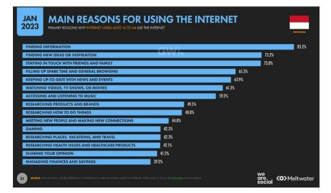
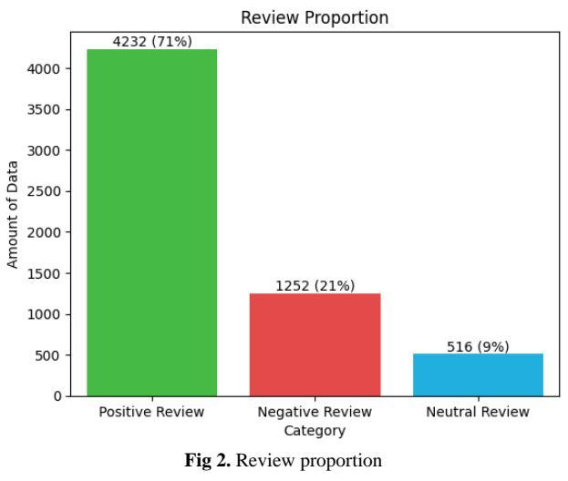
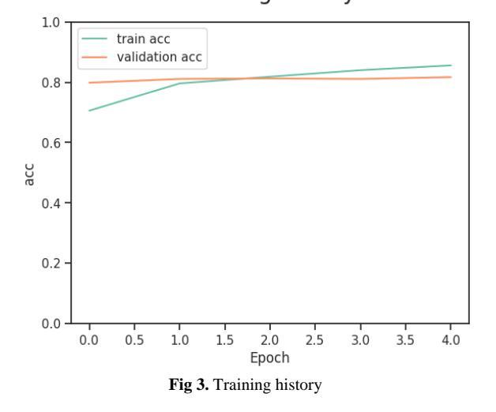
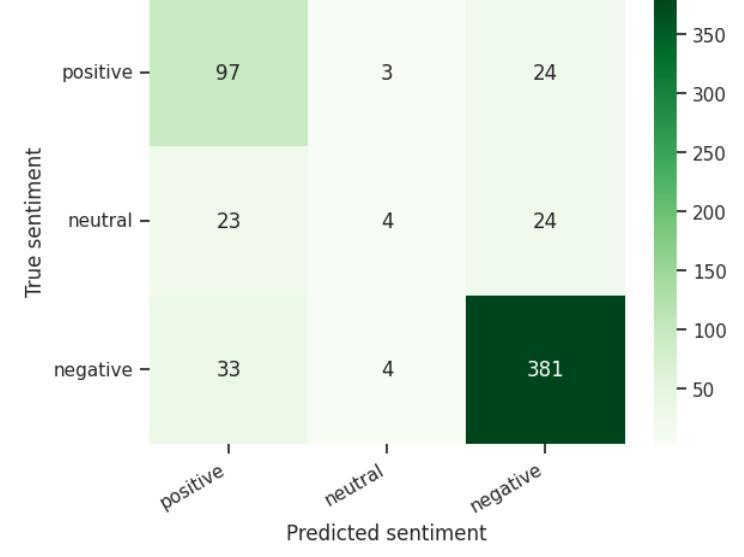

# **Sentiment Analysis of Honkai: Star Rail Indonesian Language Reviews on Google Play Store Using Bidirectional Encoder Representations from Transformers Method**

### **Zekri Fitra Ramadhan\*, Achmad Benny Mutiara**

*Faculty of Computer Science and Information Technology, Gunadarma University, Jakarta, Indonesia*

*\*Corresponding author Email: [zekrifitra@gmail.com](mailto:zekrifitra@gmail.com)*

#### *Manuscript received 24 June 2023; Revised 27 June 2023; Accepted 2 July 2023. Date of publication 20 September 2023*

#### **Abstract**

Online games are a type of entertainment that is done by humans to have fun and forget all the problems in everyday life. Honkai: Star Rail is a new online game application owned by miHoYo which is currently popular and widely downloaded on the Google Play Store. Reviews on the Honkai: Star Rail app are increasing over time so this makes it difficult for app developers to know past user reviews on their apps. Therefore, the author conducted a study to analyze sentiment towards Honkai: Star Rail application reviews in Indonesian on the Google Play Store using the Bidirectional Encoder Representations from Transformers (BERT) method to determine user sentiment towards the Honkai: Star Rail application and then processed further so that it becomes a record for developers, users, and prospective users of the Honkai: Star Rail application. This study uses Indonesian language review data from users of the Honkai: Star Rail application found on the Google Play Store website as many as 6000 reviews. The BERT method applied in this study consisted of data collection, dataset labeling, data preprocessing, dataset splitting, modeling, model training, and evaluation. Based on the evaluation results that have been carried out on the test data, 97 data are true positive with 27 data are false positive, 4 data are true neutral with 47 data are false neutral, and 381 data are true negative with 37 data are false negative. So, it can be concluded that the model still has difficulty predicting reviews with neutral sentiment but is good enough at predicting reviews with positive and negative sentiment. In addition, the accuracy of the model is 81% with a precision of 63% for positive sentiment reviews, 36% for neutral sentiment reviews, and 89% for negative sentiment reviews.

*Keywords*: *BERT, Classification, Online Game, Sentiment Analysis.*

### **1. Introduction**

Entertainment is a form of activity carried out by humans to get pleasure and forget all the problems they face in everyday life. One type of entertainment is online games, which are structured games that use internet access for entertainment. The activity of playing online games has become an inseparable part of most gadget users. According to the Datareportal website, as of January 2023, as many as 42.3% of internet users in Indonesia chose to play online games as the main reason for using the internet [5].

**Fig 1.** The main reasons for using the internet in Indonesia [5]

**Copyright © Authors. This is an open access article distributed under th[e Creative Commons Attribution License,](https://creativecommons.org/licenses/by/4.0/) which permits unrestricted use, distribution, and reproduction in any medium, provided the original work is properly cited.**

Honkai: Star Rail is a new online game application owned by miHoYo which is currently popular all over the world. Until the time of this study, the Honkai: Star Rail application on the Google Play Store has been downloaded by more than 5 million users with a rating of 4.4/5.0 from 130 thousand reviews.

As time goes by, the number of reviews on the Honkai: Star Rail application increases, so this makes it difficult for application developers to find out previous user reviews on their applications. Thus, the author uses reviews on the Google Play Store to find out user sentiment towards the Honkai: Star Rail application and then processes it further so that it becomes a record for developers, users, and potential users of the application.

A study related to sentiment analysis in online game applications made by the company miHoYo has previously been carried out by several researchers. One of them was carried out by [8] where in that study, the calculation of the performance of the sentiment analysis model using the BERT method from 12000 datasets obtained an accuracy of 74% with a precision of 0.79 for negative, 0.77 positive, and 0.70 for neutral, causing a neutral value. more difficult to detect because it has a lower accuracy value than other categories.

Based on the description above, the author took the initiative to conduct research to analyze sentiment towards reviews of the Indonesian Honkai: Star Rail application on the Google Play Store using the Bidirectional Encoder Representations from Transformers (BERT) method because the BERT method is designed to help computers understand the meaning of ambiguous language in a sentence by using the surrounding sentences to build context so that data containing ambiguous sentences in the Honkai: Star Rail application review in the Google Play Store can still be used in research [12]. These sentiments will be classified into three categories, namely positive, neutral, and negative.

#### **2. Literature Review**

#### **2.1. Sentiment Analysis**

Sentiment analysis is a field of Natural Language Processing (NLP) that studies opinions, sentiments, and emotions in a text. Sentiment analysis works by analyzing data in the form of digital text to be able to determine the emotional tone of the message [9]. The main purpose of sentiment analysis is to process, extract, summarize, and analyze information in a text using various methods so as to infer the emotions and points of view of the author from the text and share the author's subjective information about the emotional tendencies of the text included in it [7]. Sentiment analysis serves as information on the results of expressing textually opinions on an issue or to identify trends in what is happening in the market [11]. Sentiment analysis is often referred to as opinion mining because this computational study will explore the emotions contained in every word given by the user in a review [13].

Sentiment analysis has three levels, namely the document level, sentence level, and aspect level [10]. The document level and sentence level are sentiment analysis which are included in the coarse-grained sentiment analysis group, while the aspect level is included in the fine-grained sentiment analysis. The algorithm for sentiment analysis is divided into two, namely lexicon-based which uses a unique word dictionary (lexicon) and learning-based which uses training data and testing data [1].

#### **2.2. Bidirectional Encoder Representations from Transformers**

Bidirectional Encoder Representations from Transformers or abbreviated as BERT is a trained language representation model developed in 2018 by Google AI Language researchers [3]. BERT is a pre-train natural language model which means, like making a black box that understands a language then the model is asked to do a certain specific task [8]. BERT was created using semi-supervised learning, ELMo, ULMFiT, OpenAI Transformers, Transformers, and deep learning techniques.

BERT uses Transformer in its implementation. Transformers are the first transduction models that rely entirely on self-attention to calculate their input and output representations without using sequentially aligned RNNs or convolutions [14]. The transformer follows the overall architecture that most competitive neural sequence transduction models use by leveraging self-attention and point-wise stacks. Transformers have two mechanisms, namely the encoder which functions to read all input text at once and the decoder which functions to produce an output sequence in the form of a prediction.

There are two stages of training in BERT, namely pre-training and fine-tuning [4]. In the pre-training stage, BERT uses two unsupervised tasks, namely Masked Language Modeling (MLM) and Next Sentence Prediction (NSP). MLM is used to mask or disguise 15% of the input tokens at random, then predict the masked tokens. NSP is used to train the model to understand the relationship between sentences. In the fine-tuning stage, the same pre-training model parameters are used to adjust the output of the model so that it reaches the optimal point. Fine-tuning in BERT is very easy to implement because the self-attention mechanism in Transformer allows BERT to model many downstream tasks involving a single text or pairs of texts by swapping input and output accordingly. For applications involving text pairs, the general pattern is to encode the text pairs independently before applying two-way cross attention.

#### **2.3. IndoBERT**

IndoBERT is a transformer-based model in BERT style, but still trained purely as a masked language model trained using the HuggingFace framework following the default configuration for BERT-Base (uncased or uncased). IndoBERT has 12 hidden layers of 768d each, 12 attention heads, and a feed-forward hidden layer of 3,072d. [6] modified the HuggingFace framework to read separate text streams for different document blocks and set the training to use 512 tokens per batch.

#### **2.4. IndoNLU**

IndoNLU is the first Indonesian natural language understanding benchmark designed to address data scarcity in training, evaluating, and analyzing natural language comprehension systems for Indonesian. IndoNLU includes twelve diverse tasks categorized by input, such as single sentences and sentence pairs, and objectives, such as sentence classification tasks and sequence labeling tasks [15]. The IndoNLU benchmark is designed to cater to a wide variety of styles in formal and colloquial Indonesian.

#### **3. Methods**

#### **3.1. Data Collection**

Data collection was carried out using web scraping techniques on Honkai: Star Rail application reviews on the Google Play Store website by utilizing Google Colab, the Python programming language, and the google-play-scraper package. The data collected is only reviews in Indonesian as many as 6000 reviews. The data that has been collected through the web scraping process is then stored in tab separated value (.tsv) format.

#### **3.2. Dataset Labelling**

Sentiment analysis using the supervised learning method requires datasets that already have labels because the supervised learning method trains algorithms to classify data or predict results accurately using data that already has these labels. Supervised learning is an approach in machine learning and artificial intelligence that utilizes labeled data so that the model is able to produce output that is accurate and matches the desired label. In this study, the dataset will be labeled positive, neutral, and negative.

# **3.3. Data Preprocessing**

Data preprocessing is the initial stage in the processing of extracted text data before further processing up to the classification process [2]. At this stage, the dataset that has been labeled will be processed to become more structured so as to simplify the process to be carried out next. In addition, data preprocessing will also make the results of sentiment analysis better. There are four stages used in the data preprocessing process in this study, namely:

1. Data Cleaning

Data cleaning is used to clean unnecessary characters in a sentence in the data set, such as duplicate words, links, tags (@), hashtags (#), numbers, symbols, punctuation marks, and trailing spaces. This stage is also implemented to clean null data and remove unused table columns.

2. Case Folding

Case folding is used to convert all letters in the dataset to lowercase. This stage is carried out in order to facilitate the generalization process on sentiment analysis.

3. Tokenization

Tokenization is done to cut sentences in the dataset into chunks of words called tokens. At this stage, sentence cutting is based on each word that makes it up.

4. Normalization

Normalization is the process of changing non-standard words into standard words according to Indonesian spelling. If this step is not carried out, then the machine learning model will consider the misspelled word as a different word and stand alone.

#### **3.4. Dataset Splitting**

At this stage, the dataset is divided into three parts, namely trained data, validated data, and tested data. The ratio used in dividing this dataset is 70:20:10. The division of datasets is important because it determines which data will be trained, validated, and tested so that the model can group based on training data, validation data, and test data. Training data is used to train the model, validation data is used for the model validation process, and test data is used to evaluate the performance of models that have been trained using training data.

#### **3.5. Modelling**

At this stage, the BERT pre-trained model will be implemented using transfer learning techniques. Transfer learning is a method that uses existing architectures or models. Transfer learning is applied at this stage because transfer learning can carry out learning well even though it uses limited training data.

The pre-trained BERT model used in this study is the indobert-base-p1 model, which is a model that uses IndoNLU's BERT-based architecture. This model has 124.5 million parameters or Indonesian words that have been trained. The architecture of this model consists of 12 hidden layers of 768 each, 12 attention heads, and a feed-forward hidden layer of 3,072 [15].

The modeling stage consists of model loading and dataset adjustment. When the model is loaded, the author imports the BertConfig class for configuration, BertTokenizer for sentence tokenization in datasets, and BertForSequenceClassification for fine-tuning the indobertbase-p1 pre-trained model in the Transformers library. After loading the model, then the dataset is adjusted using the DocumentSentimentDataset class with tokenizer and lowercase parameters to adjust the dataset so that the resulting input matches the format used by the model and DocumentSentimentDataLoader with dataset parameters, max\_seq\_len, batch\_size, num\_workers, and shuffle which will be used later at the model training stage.

#### **3.6. Model Training**

Model training or also called fine-tuning is a stage where the model will be trained using training data and validation data. The model will receive a sequence of input phrases that continue to the encoder stack. This stage aims to find configurations that work on the dataset by adjusting the hyperparameters used. Hyperparameters that are usually used in the BERT model training process include:

- 1. Batch size which is the amount of data to be processed in one iteration. The batch size can only be varied using the value 2n, where n is an integer starting from zero. The size of the batch size affects the duration required. The larger the batch size used, the longer the duration needed to complete one batch.
- 2. Learning rate which is a parameter used to calculate the corrected value of the weights when carrying out the training process. The learning rate has a value that ranges from zero to one. The greater the learning rate value used, the faster the training process will be, however, it can cause failure to obtain the optimum global value. The smaller the learning rate used, the model will get a small loss, however, the duration of the training process will be longer.
- 3. Epoch which is the number of iterations that must be passed by the dataset in conducting training. One epoch is defined as one training model. The training process will stop when the total iteration exceeds the epoch value.

The hyperparameters in the Indobert-base-p1 model can be adjusted according to the needs of researchers. The following are the hyperparameters used in the model training stage in this study.

- 1. Batch size: 32
- 2. Learning rate: 3e-6
- 3. Epochs: 5

#### **3.7. Evaluation**

Evaluation is the final stage carried out in this study. This stage has the aim of seeing the performance of the model that has been trained in predicting sentiment classification. This stage describes the computational machine learning process for the models, data, algorithms, and functions that have been defined previously. At this stage, the results of the model are displayed using a confusion matrix. There are six categories in the confusion matrix, namely True Positive (TP), True Neutral (TNt), True Negative (TN), False Positive (FP), False Neutral (FNt), and False Negative (FN). This stage also displays the accuracy, precision, sensitivity, and F1 score of the model.

#### **4. Results and Discussion**

## **4.1. Dataset Labelling Result**

The author labels the dataset that has been previously obtained through the data collection stage. The labeling process is carried out by applying the score-based labeling technique, which is a technique in which the dataset will be labeled based on a score or rating in the Honkai: Star Rail application review. In this study, the dataset will be divided into three sentiment classes, namely positive, neutral, and negative. The labeling process was carried out by giving a positive label to data with a score of 4 and 5, a neutral label to data with a score of 3, and a negative label to data with a score of 1 and 2. After carrying out the dataset labeling process, the author obtained 4232 positive labeled review data, 1252 negative labeled reviews, and 516 neutral labeled reviews. The visualization of the proportion of reviews per category can be seen in Figure 2.

#### **4.2. Model Training Result**

Before the model training process is carried out, the dataset must be split first with the proportion of 70:20:10. The results of the splitting dataset can be seen in Table 1.

| Table 1. Dataset splitting result |                 |                 |                |  |  |  |  |
|-----------------------------------|-----------------|-----------------|----------------|--|--|--|--|
| No.                               | Data Type       | Total of Column | Amount of Data |  |  |  |  |
| 1.                                | Data Train      | 2               | 4185           |  |  |  |  |
| 2.                                | Data Validation | 2               | 1201           |  |  |  |  |
| 3.                                | Data Test       | 2               | 593            |  |  |  |  |

The training phase of this model is carried out five times according to the specified epoch value. In addition to the training process, at this stage, a validation process is also carried out using validation data.

After the training and validation process is complete, the results of the training accuracy and model validation are obtained, then stored for the visualization process. These results are visualized in a curve-shaped comparison which can be seen in Figure 3.

Figure 3 shows that this model has an increased accuracy value in training and validation. The increase in accuracy in the validation looks fluctuating, this is because there is still ambiguous data such as reviews that should have positive sentiments but in the dataset are recorded as reviews with negative sentiments. This is a weakness of the score-based labeling technique.

#### **4.3. Evaluation Result**

The model that has been trained and validated is then tested using test data, then the results of the model test are saved in a file in CSV format. The results of testing the model that has been trained are then evaluated using a confusion matrix that displays the performance of the model in classifying sentiment. The confusion matrix of the results of the testing model can be seen in Figure 4.

**Fig 4.** Confusion matrix of model test results

Based on Figure 4 there are 97 data true positive values with 27 data false positive values, 4 data true neutral values with 47 data false neutral values, and 381 data true negative values with 37 data false negative values. This shows that the model still has difficulties in predicting reviews with neutral sentiment, but it is good enough in predicting reviews with positive and negative sentiments.

After getting the results from the confusion matrix, then calculating the accuracy, precision, sensitivity, and F1 score of the model using the classification\_report() function from the metrics module in the Sklearn library. The results of evaluation calculations with the classification\_report() function can be seen in Figure 5.

|             | <b>DIELLSTAIL</b> |      | $TCLGLL$ $1T-2CME$ | support |
|-------------|-------------------|------|--------------------|---------|
| positive    | 0.63              | 0.78 | 0.70               | 124     |
| neutral     | 0.36              | 0.08 | 0.13               | 51      |
| negative    | 0.89              | 0.91 | 0.90               | 418     |
| accuracy    |                   |      | 0.81               | 593     |
| macro avg   | 0.63              | 0.59 | 0.58               | 593     |
| eighted avg | 0.79              | 0.81 | 0.79               | 593     |
|             |                   |      |                    |         |

**Fig 5.** Classification report of model test results

Figure 5 shows that the model has an accuracy of 81% with a precision of 63% for positive sentiment reviews, 36% for neutral sentiment reviews, and 89% for negative sentiment reviews. This can happen because the number of neutral sentiment reviews is less than the number of positive sentiment reviews and negative sentiment reviews.

#### **5. Conclusion**

Based on the results and discussion that has been described, it can be concluded that sentiment analysis of Indonesian language reviews of the Honkai: Star Rail application on the Google Play Store website using the Bidirectional Encoder Representations from Transformers (BERT) method was successfully carried out. Sentiment analysis was carried out using the pre-trained indobert-base-p1 model from IndoNLU with hyperparameter 32 batch size, 3e-6 learning rate, and 5 epochs. A total of 6000 reviews were used as a dataset in this study, then divided into three sentiments, namely positive sentiment as many as 4232 reviews, neutral sentiment as many as 516 reviews, and negative sentiment as many as 1252 reviews. The test results of the pre-trained model that have been trained show that the model is able to classify with an accuracy of 81%, but the model has a little difficulty in classifying neutral sentiment reviews because the number of neutral sentiment reviews in the dataset is less than positive sentiment reviews and negative sentiment reviews. The results of the model test also show that reviews of the Honkai: Star Rail app tend to have negative sentiments, this is due to the test data having more negative sentiment reviews than positive sentiment reviews and neutral sentiment reviews.

#### **Acknowledgement**

The author would like to thank Achmad Benny Mutiara as the supervising lecturer who has assisted in this research.

#### **References**

- [1] V. Bonta, N. Kumaresh, and N. Janardhan, "A Comprehensive Study on Lexicon Based Approaches for Sentiment Analysis," *Asian Journal of Computer Science and Technology*, vol. 8, no. S2, pp. 1–6, Mar. 2019, doi: 10.51983/ajcst-2019.8.s2.2037.
- [2] D. Darwis, E. S. Pratiwi, and A. F. O. Pasaribu, "PENERAPAN ALGORITMA SVM UNTUK ANALISIS SENTIMEN PADA DATA TWITTER KOMISI PEMBERANTASAN KORUPSI REPUBLIK INDONESIA," *Edutic - Scientific Journal of Informatics Education*, vol. 7, no. 1, Nov. 2020, doi: 10.21107/edutic.v7i1.8779.
- [3] J. Devlin, M.-W. Chang, K. Lee, and K. Toutanova, "BERT: Pre-training of Deep Bidirectional Transformers for Language Understanding," in *Proceedings of the 2019 Conference of the North American Chapter of the Association for Computational Linguistics: Human Language Technologies, Volume 1 (Long and Short Papers)*, Minneapolis, Minnesota: Association for Computational Linguistics, Jun. 2019, pp. 4171–4186, doi: 10.18653/v1/N19-1423.
- [4] X. Han *et al.*, "Pre-trained models: Past, present and future," *AI Open*, vol. 2, pp. 225–250, Jan. 2021, doi: 10.1016/j.aiopen.2021.08.002.
- [5] S. Kemp, "Digital 2023: Indonesia," *https://datareportal.com/reports/digital-2023-indonesia*, Feb. 09, 2023.
- [6] F. Koto, A. Rahimi, J. H. Lau, and T. Baldwin, "IndoLEM and IndoBERT: A Benchmark Dataset and Pre-trained Language Model for Indonesian NLP," *CoRR*, vol. abs/2011.00677, 2020, doi: 10.48550/arXiv.2011.00677.
- [7] B. Kurniawan, A. Ari Aldino, and A. Rahman Isnain, "SENTIMEN ANALISIS TERHADAP KEBIJAKAN PENYELENGGARA SISTEM ELEKTRONIK (PSE) MENGGUNAKAN ALGORITMA BIDIRECTIONAL ENCODER REPRESENTATIONS FROM TRANSFORMERS (BERT)," *Jurnal Teknologi dan Sistem Informasi (JTSI)*, vol. 3, no. 4, pp. 98-106, 2022. [Online]. Available: http://jim.teknokrat.ac.id/index.php/JTSI
- [8] R. Kusnadi, Y. Yusuf, A. Andriantony, R. Ardian Yaputra, and M. Caintan, "ANALISIS SENTIMEN TERHADAP GAME GENSHIN IMPACT MENGGUNAKAN BERT," *Rabit : Jurnal Teknologi dan Sistem Informasi Univrab*, vol. 6, no. 2, pp. 122– 129, Jul. 2021, doi: 10.36341/rabit.v6i2.1765.
- [9] S. Maulida and A. Slamet Rusydiana, "Islamic Microinsurance: Problem, Future Prospect and Sentiment Analysis," *Tamkin Journal*, vol. 2, no. 1, 2023, [Online]. Available: http://journals.smartinsight.id/index.php/TJ/index
- [10] H. T. Phan, N. T. Nguyen, and D. Hwang, "Convolutional attention neural network over graph structures for improving the performance of aspect-level sentiment analysis," *Inf Sci (N Y)*, vol. 589, pp. 416–439, Apr. 2022, doi: 10.1016/j.ins.2021.12.127.
- [11] M. W. Prihatmono and Ida, "KOMPARASI ALGORITMA KLASIFIKASI UNTUK SENTIMEN ANALYSIS DJ.ID PADA TWITTER", *Progres*, vol. 12, no. 1, pp. 1-11, Apr. 2020.
- [12] S. B. Rajeshwari and J. S. Kallimani, "Development of Optimized Linguistic Technique Using Similarity Score on BERT Model in Summarizing Hindi Text Documents," in *Innovative Data Communication Technologies and Application*, J. S. Raj, K. Kamel, and P. Lafata, Eds., Singapore: Springer Nature Singapore, 2022, pp. 767–781, doi: 10.1007/978-981-16-7167-8\_56.
- [13] J. Serrano-Guerrero, F. P. Romero, and J. A. Olivas, "Fuzzy logic applied to opinion mining: A review," *Knowl Based Syst*, vol. 222, p. 107018, 2021, doi: 10.1016/j.knosys.2021.107018.
- [14] A. Vaswani *et al.*, "Attention Is All You Need," *CoRR*, vol. abs/1706.03762, 2017, doi: 10.48550/arXiv.1706.03762.
- [15] B. Wilie *et al.*, "IndoNLU: Benchmark and Resources for Evaluating Indonesian Natural Language Understanding," *CoRR*, vol. abs/2009.05387, 2020, doi: 10.48550/arXiv.2009.05387.